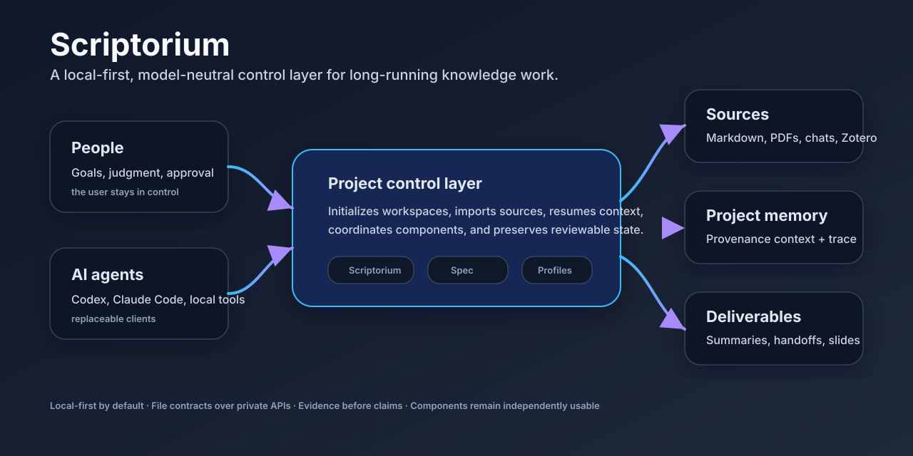

# Scriptorium

[](https://github.com/scriptorium-suite/scriptorium/actions/workflows/ci.yml)
[](https://github.com/scriptorium-suite/scriptorium/releases)
[](LICENSE)

Scriptorium is a local-first, model-neutral control layer for long-running knowledge work. It helps a person, one or more AI agents, source files, research tools, and deliverables keep using the same recoverable project state instead of restarting from scattered chats and folders.



## Why it exists

AI agents are useful in complex work, but most of the work disappears into chat history: what sources were used, which decisions were accepted, what remains uncertain, and how the next session should resume. Scriptorium turns that moving context into a local project workspace that can be inspected, resumed, and handed off.

The first validated scenario is research and AI4Science-style work, because it requires strong source tracking, literature context, human review, and deliverable generation. The product boundary is wider: Scriptorium can also be used for engineering maintenance, product discovery, personal knowledge projects, or any long project where AI assistance needs durable memory.

## What works in the current public release

The current stable release focuses on the front half of the product loop: create a clean workspace, bring local material under control, install compatible components, and resume future AI sessions from an explicit project state.

| Capability | Current status |
| --- | --- |
| Workspace initialization | Stable: creates the project layout, config, review surface, and local state folders. |
| Source inventory and migration | Stable: preview-first import for selected Markdown/PDF material. |
| Project resume | Stable: asks Provenance for a bounded context capsule instead of loading raw history. |
| Component installation | Stable: installs pinned suite components from the catalog. |
| Capture install | Stable: installs the browser conversation export extension from the Provenance release asset. |
| Evidence review and execution loop | Development branch: not positioned as the current stable product path. |
| Slide/PPT generation | Optional component direction; not the focus of this release. |

## Quick start on Windows

Scriptorium is aimed at users who are comfortable cloning GitHub projects and running Python tools locally.

```powershell
git clone https://github.com/scriptorium-suite/scriptorium.git
cd scriptorium
py -m venv .venv
.\.venv\Scripts\python.exe -m pip install -e .
.\.venv\Scripts\scriptorium.exe doctor
```

Create a project workspace:

```powershell
.\.venv\Scripts\scriptorium.exe init `
  --workspace D:\Research\demo-workspace `
  --project-name "My long-running project"
```

Preview a local import before anything is copied:

```powershell
.\.venv\Scripts\scriptorium.exe inventory `
  --workspace D:\Research\demo-workspace `
  --source D:\Research\notes `
  --json
```

Resume a later AI session from the saved project state:

```powershell
.\.venv\Scripts\scriptorium.exe resume `
  --workspace D:\Research\demo-workspace
```

## The suite model

Scriptorium is the entry point. The other repositories remain independently usable and communicate through files defined by [scriptorium-spec](https://github.com/scriptorium-suite/scriptorium-spec), not through private APIs.

| Repository | Role |
| --- | --- |
| [scriptorium](https://github.com/scriptorium-suite/scriptorium) | Product entry point, workspace lifecycle, component catalog, install profiles, status and resume commands. |
| [scriptorium-spec](https://github.com/scriptorium-suite/scriptorium-spec) | Shared JSON Schemas, examples, and conventions that keep the suite interoperable. |
| [Provenance](https://github.com/foxsplendid/Provenance) | Local project memory, ingestion, de-identification, search, context capsules, MCP, and session writeback. |
| [steward](https://github.com/scriptorium-suite/steward) | Reference-library and literature workflow component for safe reading, review, proposal, and handoff files. |
| [Academic-Slides-Agent](https://github.com/foxsplendid/Academic-Slides-Agent) | Optional slide/report component direction. It is intentionally not required for the current stable flow. |

Capture is not a separate repository. It is a small browser-export tool released from Provenance and installable through the Scriptorium component catalog.

## Product flow

```text
local notes / PDFs / chats
        │
        ▼
scriptorium init + inventory + migration preview
        │
        ▼
workspace project state
        │
        ├── Provenance: recoverable context and local memory
        ├── Steward: literature and source handoffs
        └── Spec: shared contracts between tools
        │
        ▼
future AI sessions resume from a bounded context capsule
```

The important rule is simple: raw material, AI-generated drafts, and user-confirmed project memory are separate. The stable release does not ask users to trust hidden agent state.

## Install independent components

List available install profiles:

```powershell
.\.venv\Scripts\scriptorium.exe install --list
```

Install Capture only:

```powershell
.\.venv\Scripts\scriptorium.exe install capture `
  --target D:\Tools\scriptorium-capture `
  --run
```

Install the core runtime components into an isolated directory:

```powershell
.\.venv\Scripts\scriptorium.exe install core `
  --target D:\Tools\scriptorium-core `
  --run
```

## Documentation

- [Architecture and acceptance](docs/architecture-and-acceptance.zh-CN.md)
- [Synthetic case study](docs/case-study.zh-CN.md)
- [Showcase evidence](docs/showcase/README.zh-CN.md)
- [Acknowledgements](ACKNOWLEDGEMENTS.md)

## Privacy and safety posture

Scriptorium is local-first by default. It does not require a hosted account, does not upload private research material as part of the core workflow, and treats browser export, Zotero, Obsidian, and slide generation as optional integrations. The public examples are synthetic and intentionally scrubbed.

The project is still early-stage software. Use preview commands before write commands, keep backups of important workspaces, and review generated material before treating it as project memory.

## Development and verification

Run the local test suite:

```powershell
.\.venv\Scripts\python.exe -m pytest
```

Run release-oriented smoke checks before publishing:

```powershell
.\.venv\Scripts\scriptorium.exe doctor
.\.venv\Scripts\scriptorium.exe install --list
```

## License

Apache-2.0. See [LICENSE](LICENSE).
