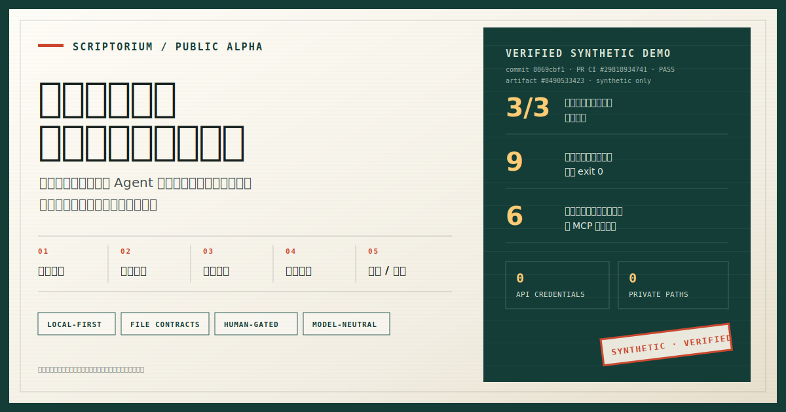

# Scriptorium

> **Public Alpha v0.1.0：** 当前 umbrella 仓库已交付真实项目的安全初始化、一个
> 通过 `scriptorium demo` 跑通的合成纵向切片、只读诊断入口 `scriptorium doctor`、
> 不暴露内容的 `scriptorium status` 控制面状态摘要、仅盘点显式本地来源且零写入的
> `scriptorium inventory` 预览，以及显式、项目级的 Codex /
> Claude Code 技能安装器。已确认的按需入口 `scriptorium pull` 也已通过 Provenance
> 的机器可读公共命令交付。GitHub-hosted 干净 Windows CI 与隔离的 Windows 源码
> 安装验收已通过；Agent host 实时对等路径与 Lectern 仍不属于无凭据黄金路径。

Scriptorium 是面向科研工作者的本地优先、Agent 原生研究工作流套件。本仓库是
它的薄控制面：通过公开 CLI 与版本化文件编排可独立使用的组件，不导入组件内部
模块，也不成为论文库、项目笔记或科研记忆的新数据主库。

[English](README.md) · [中文产品案例](docs/case-study.zh-CN.md) · [展示与证据](docs/showcase/README.zh-CN.md) · [契约单一事实源](https://github.com/scriptorium-suite/scriptorium-spec) · [设计借鉴与致谢](ACKNOWLEDGEMENTS.zh.md)



## 当前真正可用的内容

`scriptorium init` 可以预览或创建真实科研项目的最小结构：套件配置、彼此分离的
Markdown workspace 与 Provenance 数据根目录，以及一份有效的 `project/1.0` 项目笔记。
默认只预览，必须显式增加 `--run` 才会写入；已有文件不会被重写。选择 host 只会把
该选择记录到配置中，不会安装 host adapter、模型或 hook；init 不申请网络动作，也不
读取 provider 凭据。初始化后，如果没有更高优先级的 CLI 参数或环境变量，
`host install`、`doctor`、`status` 和 `pull` 可以从套件配置解析相应的
workspace、数据根与项目选择。

`doctor`、`status` 和 `pull` 会说明各根目录来自 CLI、环境变量、套件配置还是自动发现。
`status` 与 `pull` 报告不会回显实际路径；`doctor` 是详细的本地诊断，其报告包含
已解析路径，分享前必须审阅。若环境变量选择与套件配置不一致，命令会显示显著警告；
`pull --run` 将 fail closed，直到用户用显式 CLI 根目录消除歧义。所选 Codex 日志目录
不可用时，会被视为“0 个会话 + 可执行的设置提示”，而不是内部错误；套件也不会隐式
创建该目录。

`scriptorium demo` 会建立一个隔离的 Markdown 工作区，并通过真实公开接口跑通
一条合成 AI4Science 文献工作流：

1. 使用 `scriptorium-spec` 校验合成 `library-kb/1.1`；
2. 调用 Steward 选出两篇主题文献，并从录制的 Agent 草稿组装综述；
3. 调用 Provenance 摄取文献库与 Markdown 项目；
4. 构建和查询本地全文索引；
5. 通过 Provenance MCP 验证项目组合、当前上下文和文献检索；
6. 生成可阅读成果与机器可读的 `demo-report.json`。

该流程不需要 API Key、Zotero、Obsidian、浏览器扩展或 Agent 登录。源码安装
完成后，此 demo 路径被设计为不申请网络动作；它不会调用在线模型，Agent 产出是
明确标注的合成 fixture。报告也会说明：当前网络边界来自代码与策略约束，尚未由
操作系统级沙箱观测。Demo 通过只证明契约与组件集成链路可复现，不等于完整
Public Alpha 已就绪，更不代表其中内容是真实科研结论。

`scriptorium doctor` 独立检查安装与能力就绪度。它运行只读探针，不申请套件自身的
网络动作或 GUI 启动，不打印 secret 值；可选组件只形成对应能力证据；并明确区分
可运行的 Demo target 与完整 Public Alpha target。操作系统级子进程出站并未被观测。
只有当检测到的 host CLI 与所选 workspace 中已登记、内容 canonical 的技能相匹配时，
doctor 才会通过 host adapter 检查。它会真实探测 `prov-sync-pull --capabilities --json`，
而不是把源码存在误报成可运行；Public Alpha 还要求显式 Provenance 数据根。

`scriptorium pull` 是上述 Provenance 公共命令的薄封装。默认模式为零权威写入的预览，
只有 `--run` 才显式授权本地摄取、捕获、单 worker 与审批队列刷新。它不会调用模型、
安装 hook、申请网络动作或批准未勾选的声明。首次运行正常情况下可能返回
`action-required`：所选 Agent 在当前会话审阅已脱敏 scaffold 并写入 fill；再次 pull
才会提交低风险 timeline，并把高价值声明放入 `Approvals.md`。这些声明仍必须由用户
勾选，之后的 pull 才会提交。

`scriptorium status` 是日常使用且不暴露内容的控制面状态摘要。它先重建 `doctor` 的
Public Alpha 就绪结论；只有该边界就绪时，才执行一次 `pull` 预览。结果只包含
白名单化的能力状态、工作流聚合计数和固定审阅提示，不会透传本地路径、项目或会话
标识、科研正文、组件 stderr 或原始诊断细节，也绝不会调用 `--run`。`attention`
是正常的 exit-0 待办；未就绪或安全阻断返回 1，可信 pull 预览报告错误或入口无法
形成可信报告时返回 2。status 与其中的预览都不会授权套件写入项目或数据；就绪检查
仍会调用外部版本/能力探针，其操作系统级副作用尚未被观测。

`scriptorium inventory` 是已有科研资料进入套件前的安全盘点边界。它只扫描用户显式
传入的 Markdown/PDF 来源、AI 对话导出或 Zotero 导出；只读取文件系统元数据与后缀，
不会打开正文或压缩包、自动发现个人目录、写入迁移计划、调用组件、申请网络动作或
调用模型。默认报告不含路径和文件名，只给出候选总数以及 workspace、文献原址引用、
Provenance 导入审阅、Steward 审阅四类路由。该预览不验证文件内容、不去重、不复制
资料，也不会声称迁移已经发生。在 Windows 上，命令会在预览期间以仅元数据句柄绑定
选中对象，因此其他进程需等命令结束后才能重命名、删除或以数据写权限打开这些对象。

## Windows 源码快速体验

前置条件：Git 与 Python 3.11+。先把四个仓库克隆到同一个父目录，使源码发现
路径明确且可复现：

```powershell
mkdir scriptorium-workspace
cd scriptorium-workspace
git clone https://github.com/scriptorium-suite/scriptorium.git
git clone https://github.com/scriptorium-suite/scriptorium-spec.git
git clone https://github.com/scriptorium-suite/steward.git
git clone https://github.com/foxsplendid/Provenance.git Provenance

cd scriptorium
python -m venv .venv
.\.venv\Scripts\python.exe -m pip install --no-deps -e .

# Install the two runtime components into the same isolated environment:
.\.venv\Scripts\python.exe -m pip install --no-deps -e ..\steward
.\.venv\Scripts\python.exe -m pip install --no-deps -e ..\Provenance
```

根据本地 Python 环境，editable 安装可能访问已配置的包索引以取得
`setuptools>=68` 等声明的构建依赖。“运行期不申请网络动作”只适用于源码安装完成后，
不代表离线安装保证。

### 可选：预览已有本地资料

只传入你主动选择的本地文件或目录。Zotero 与对话导出均为可选；实时 Zotero 数据库
和 Agent profile 不会被自动发现。

```powershell
.\.venv\Scripts\scriptorium.exe inventory `
  --source 'D:\Research\Legacy Notes' `
  --conversation-export 'D:\Exports\chat-history.zip' `
  --zotero-export 'D:\Exports\library.bib'
```

该命令只做分类，始终保持 preview 模式。默认终端输出与 `--json` 都只包含计数和固定
路由标签，不含本地路径、文件名、科研正文、哈希、大小或时间。扫描不完整或来源不安全
时会 fail closed 并返回退出码 `1`；参数错误或入口边界内部失败返回 `2`，且不会回显
敏感输入。

### 真实项目的 10 分钟路径

以下命令创建真实 Markdown 项目，而不是使用合成 demo。workspace 与 Provenance
数据根必须是两个互不嵌套的独立目录；如果选择的是 Claude Code，请把示例中的
`codex` 一致替换为 `claude-code`。

```powershell
$Workspace = Join-Path $HOME "Research\ai4science-pilot"
$ProvenanceHome = Join-Path $HOME "Research\scriptorium-data"

# Preview only: no file or directory is created.
.\.venv\Scripts\scriptorium.exe init `
  --workspace $Workspace `
  --provenance-home $ProvenanceHome `
  --project-id ai4science-pilot `
  --title "AI4Science Pilot" `
  --host codex `
  --idea "Test whether an evidence-traceable agent workflow improves research continuity."

# Apply the same reviewed plan.
.\.venv\Scripts\scriptorium.exe init `
  --workspace $Workspace `
  --provenance-home $ProvenanceHome `
  --project-id ai4science-pilot `
  --title "AI4Science Pilot" `
  --host codex `
  --idea "Test whether an evidence-traceable agent workflow improves research continuity." `
  --run

# These commands omit workspace/data flags and use the suite config created by init.
.\.venv\Scripts\scriptorium.exe host install codex
.\.venv\Scripts\scriptorium.exe doctor --target public-alpha
.\.venv\Scripts\scriptorium.exe status
```

在 `$Workspace` 中打开或重启 Codex，然后发送第一条提示：

```text
$scriptorium-research Read Projects/ai4science-pilot.md, turn the initial intuition into one falsifiable research question, and propose the smallest evidence-backed next step. Do not write high-value project claims until I approve the exact change.
```

回到 PowerShell，先预览本地捕获/同步计划，再显式执行已经审阅的计划：

```powershell
.\.venv\Scripts\scriptorium.exe pull
.\.venv\Scripts\scriptorium.exe pull --run
.\.venv\Scripts\scriptorium.exe status
```

init 默认把套件选择写入 `~/.config/scriptorium/scriptorium/config.toml`；可以用
`--config-dir` 或 `SCRIPTORIUM_CONFIG_DIR` 选择其他配置族根目录。该配置只保存格式
版本、workspace 路径、Provenance 数据根路径、所选 hosts 与默认项目。对应路径不存在时，
init 会创建 `Projects`、`Inbox`、`_planning`、独立的数据根目录和最小项目笔记；
host adapter 安装、模型访问、hook、网络动作和凭据始终是独立且显式的步骤。
`doctor` 返回 `1` 表示诊断已经完成、仍有修复指引需要处理，并不表示初始化数据已损坏。

项目笔记默认把 workspace 作为会话归属解析根目录，与上面的命令路径一致。如果 Agent
会从另一个已经存在的代码仓库运行，请在预览和 `--run` 两次命令中都用
`--linked-repo` 显式传入该目录。

### 可选的合成集成 demo

如果只想在不使用真实项目的情况下检查组件集成，可以继续运行不需要凭据的 demo：

```powershell
.\.venv\Scripts\scriptorium.exe doctor `
  --target demo `
  --spec-root ..\scriptorium-spec `
  --steward-root ..\steward `
  --provenance-root ..\Provenance

.\.venv\Scripts\scriptorium.exe demo `
  --output .\scriptorium-demo `
  --spec-root ..\scriptorium-spec `
  --steward-root ..\steward `
  --provenance-root ..\Provenance

# Choose one supported host; run both commands if both hosts should see the skill:
.\.venv\Scripts\scriptorium.exe host install codex `
  --workspace .\scriptorium-demo\workspace
# .\.venv\Scripts\scriptorium.exe host install claude-code `
#   --workspace .\scriptorium-demo\workspace

# Preview first; this makes no authoritative data write:
.\.venv\Scripts\scriptorium.exe pull `
  --workspace .\scriptorium-demo\workspace `
  --provenance-home .\scriptorium-demo\provenance `
  --provenance-root ..\Provenance

# Run the reviewed local plan:
.\.venv\Scripts\scriptorium.exe pull `
  --workspace .\scriptorium-demo\workspace `
  --provenance-home .\scriptorium-demo\provenance `
  --provenance-root ..\Provenance `
  --run
```

四个仓库相邻且组件命令可发现时，可直接运行：

```powershell
scriptorium doctor --target demo
scriptorium demo
```

对带有 Scriptorium demo 标记的目录重复运行在功能上是幂等的；带摄取时间戳的生成记录
可能不会逐字节一致。非空但没有该标记的目录会被拒绝，不会覆盖用户文件。

## Agent 宿主适配

`scriptorium host install` 会把包内唯一的 `scriptorium-research` Agent Skill 投影到
用户明确选择的现有 workspace。Codex 的目标是
`.agents/skills/scriptorium-research/SKILL.md`，Claude Code 的目标是
`.claude/skills/scriptorium-research/SKILL.md`；两者来自同一个 canonical 源，
不会演化成两套提示词分支。

```powershell
# Preview only; do not write:
scriptorium host install codex --workspace D:\Research\MyProject --dry-run

# Install one host; run the second command only when both are needed:
scriptorium host install codex --workspace D:\Research\MyProject
scriptorium host install claude-code --workspace D:\Research\MyProject
```

命令要求一个通过 `--workspace`、环境变量或套件配置选定的现有 workspace，绝不会
隐式回退到当前目录；它拒绝覆盖未托管或已修改内容，拒绝穿越 symlink/junction，
并在 `.scriptorium/host-adapters.v1.json` 中登记托管 hash，使重复
安装保持幂等、未被修改的旧官方资产可安全升级。它不会下载软件、登录、启动 GUI、
安装 hook 或修改全局宿主设置。安装后应在该 workspace 中新开或重启宿主并检查技能
列表；doctor 验证的是静态文件与匹配 CLI，不代表在线模型或会话内发现已经实测。
并发安装会通过 workspace 锁 fail closed；若进程崩溃，确认现场后再移除空的
`.scriptorium/host-install.lock`。

## 按需 pull

两种模式都显式且本地；需要稳定机器报告时增加 `--json`：

```powershell
scriptorium pull --workspace D:\Research\Workspace --provenance-home D:\Research\ProvenanceData
scriptorium pull --workspace D:\Research\Workspace --provenance-home D:\Research\ProvenanceData --run
```

两个路径都必须已经存在；Scriptorium 永不把当前目录隐式当作科研数据根。已登记的
canonical Codex adapter 会启用保守的本地日志扫描（只收已登记项目、最近且稳定的日志、
排除 Desktop）。安装 Claude Code skill 不等于其可选 `SessionEnd` enqueue hook 已安装或
完成 live 验证；该捕获路径仍需用户单独显式配置。`--project` 只收窄 Codex 发现范围，
workspace 摄取和已有同步队列仍是 workspace-wide。

如果报告出现 `project-resolution`，对应事件会继续保留在受保护的 inflight 状态；
Scriptorium 不会为未解析项目生成摘要、timeline 或 draft。请在 Markdown workspace 中
批准或补充正确的 `project_id` / `linked_repo` 映射，再次 pull 后会继续原事件而不是将其
退休。canonical research skill 通过默认隐藏路径的只读 `prov-sync-unresolved` 检查未解析
事件。出现 `agent-fill` 时，它只通过 `prov-sync-pending` 读取白名单化的已净化 scaffold，
并只通过 `prov-sync-fill` 提交用户批准的候选 fill；不会拼接受保护路径或直接写
`fill.json`。提交 fill 与后续执行权威 `--run` 需要分别授权。

退出码 `0` 包括成功预览/执行和正常的 `action-required` 待办；`1` 表示安全阻断或部分
阶段失败；`2` 表示入口无法形成可信报告。pull 报告按设计只包含聚合信息：组件原始输出、
本地路径、会话标识和科研正文都会在入口边界被抑制。

## 就绪度诊断

默认 target 检查完整产品边界：

```powershell
scriptorium doctor `
  --workspace .\scriptorium-demo\workspace `
  --provenance-home .\scriptorium-demo\provenance
scriptorium doctor --json `
  --workspace .\scriptorium-demo\workspace `
  --provenance-home .\scriptorium-demo\provenance
```

所选 target 没有必需项失败时返回 `0`；诊断成功但缺少必需项时返回 `1`；只有 doctor
自身无法形成可信报告时才返回 `2`。Zotero、Obsidian、PowerPoint、Lectern 或浏览器
扩展缺失，只会降级对应能力。Agent 登录、浏览器扩展权限、GUI 启动、workspace 写入
与真实网络行为均明确标为未测试。检测到应用或命令，不等于对应 live integration、
provider 或真实产出已经验证。Public Alpha 的 workspace 证据至少要求一个带完整
`project/1.x` frontmatter 的 `Projects/*.md` 笔记；普通仓库 README 不会被误判为科研
workspace。`entry.pull` 只有在兼容的机器可读能力探针通过时才通过。Codex 是当前第一条
可执行会话捕获路径；仅安装 Claude 的配置在其 opt-in `SessionEnd` hook 完成 live 验证前，
仍会被诚实标为人工就绪项。

## 套件工作流状态

`init` 完成后，日常命令可以直接读取套件配置，不再重复输入路径：

```powershell
scriptorium status
scriptorium status --json
```

该命令是不暴露内容的聚合，不代表同步授权。它会报告 Public Alpha 就绪度、可选的
Literature / Slides / Web-history 能力、基于当前 pull 预览的 freshness、聚合待办计数
和有序审阅提示。`review-pull-plan` 用于打开普通预览；阻塞或错误结果中的
`pull-diagnostics` 会重新进入同一个不暴露内容的公共诊断入口，两者都只指向普通
`scriptorium pull`。用户必须在独立预览中确认计划，之后才能另行显式增加 `--run`。
项目解析、Agent fill、人工审批与 workspace 审阅仍是人机协作提示，不会伪装成能
自动完成这些动作的命令。

`ready` 与 `attention` 返回 0，使正常人工审核待办不会被误判成基础设施故障；
`incomplete` 或 `blocked` 返回 1。可信 pull 预览报告错误，或入口无法形成可信报告时，
`error` 返回 2。在组件提供稳定契约前，最近一次成功 pull 时间会诚实标为
`not-reported`；命令不会自创“超过 N 天”阈值，也不会解析旧的 Provenance 人类可读
status 输出。

## 产物结构

```text
scriptorium-demo/
├── fixtures/                         # 明确标注的合成输入
├── workspace/
│   ├── Projects/                     # project/1.0 Markdown
│   ├── Reviews/                      # Steward 组装的综述
│   └── Reports/                      # Provenance 检索与 MCP 证据
├── provenance/
│   ├── memory/                       # 隔离的文献/项目快照
│   └── search-index.db               # 隔离的本地 FTS5 索引
└── demo-report.json                  # 阶段、断言、边界和产物
```

所有子进程的 `PROVENANCE_HOME`、`PROVENANCE_VAULT`、临时目录与配置主目录
都被重定向到 demo 目录。子进程只继承最小环境白名单，不继承用户的模型、Zotero
或 provider 凭据。入口自身不含网络客户端；操作系统级网络/文件写入探针仍属于
发布加固项，当前报告不会假装已经观测到它们。

## 当前兼容基线

- `scriptorium-spec` 2.2.0
- Steward 0.2.0
- Provenance 0.17.0

首个 golden path 将以上版本作为协同 Public Alpha 的发布目标，并在 demo 与 CI 中
继续固定精确组件提交。版本范围兼容策略暂不靠猜测定义，而是在获得外部 Alpha
使用证据后再确定。

## 紧邻的产品增量

1. 在 Provenance MCP 之上增加精炼的项目 context-capsule/resume 入口，并与不暴露
   内容的控制面 `status` 明确区分；
2. 增加需要显式人审的适配器级迁移清单与执行路径；
3. 补齐 Lectern handoff 的 schema 驱动跨仓 E2E；
4. 验证 Claude Code `SessionEnd` 与 Codex 捕获路径的实时对等性；
5. 开展外部用户 Alpha，用实测结果决定安装打包与兼容版本范围。

Apache-2.0，无遥测。
