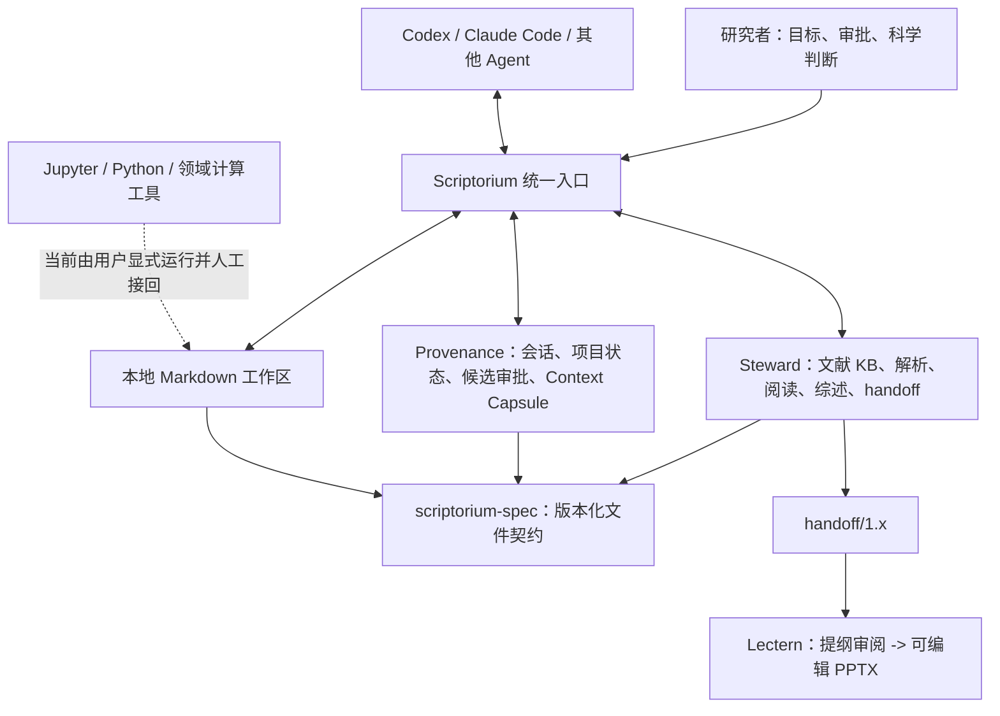

# Scriptorium 架构、使用与分层验收说明

> 文档状态：开发验收说明，依据 2026-07-23 的公开代码工作区编写。
>
> 当前已发布的 umbrella 基线仍是 Public Alpha v0.1.0；工作树正在形成 V0.2.0 候选版。本文中的 V0.2、V0.3、V0.4 是分层验收目标，不等同于已经发布。

## 1. 一句话理解这个产品

**Scriptorium 是本地优先、模型中立的科研项目控制层。它连接研究者、AI Agent、文献工具和计算执行器，把研究问题、会话、实验、证据和交付物沉淀为可恢复、可审查、可追溯的项目状态。**

通俗地说，它不是替研究者自动“做完科研”，也不是另一个聊天机器人。它负责让科研过程不断线：

- 新一轮 AI 协作能知道项目做到哪里；
- 文献、会话、判断和交付物能找到来源；
- AI 建议与研究者已经确认的结论不会混在一起；
- 关键写入先预览、再确认，必要时可以回滚；
- Codex、Claude Code 或其他 Agent 可以更换，项目状态仍留在本地文件和版本化契约中。

“实验进入项目状态”是产品方向。`experiment-run/1.0` 与 `claim-evidence/1.0`
已经作为正式文件契约存在，但当前还没有运行登记命令、持久化与查询路径、结果与 Claim
的关联，也没有统一执行器接口。现阶段实验仍由用户在 Jupyter、Python 或领域软件中运行，
再把经过审阅的结果接回项目。

## 2. 各组件分别做什么

| 组件 | 面向用户的职责 | 不负责什么 |
|---|---|---|
| **Scriptorium（umbrella）** | 统一入口；初始化项目；检查环境；盘点显式选中的资料；触发会话同步；读取恢复上下文；安装项目级 Agent Skill | 不直接拥有 Zotero、记忆库或 PPT 编译器；不在后台偷偷运行 |
| **scriptorium-spec** | 定义各组件交换的 JSON Schema 和约定，是跨仓库数据契约的唯一事实来源 | 没有运行时产品，也不保存用户研究数据 |
| **Steward** | 管理文献资料；导出文献 KB；解析论文；生成阅读、脉络、综述和 `handoff/1.x` 交接包 | 不替用户确认科学结论；不作为项目记忆所有者 |
| **Provenance** | 保存会话、项目状态、审批候选、文献研究产物和检索索引；生成有边界的 Context Capsule | 不替 Agent 做开放式推理；不会把 `reference_only` 资料自动升级为正式结论 |
| **外部 Agent** | 阅读项目上下文，辅助梳理问题、查文献、设计分析、填写待审候选 | 不是项目事实的最终裁决者 |
| **外部计算执行器** | 运行 Python、Jupyter、领域软件或其他可验证实验 | 当前尚未通过统一的 Scriptorium 实验账本接线 |
| **Lectern** | 消费论文或 `handoff/1.x`，先生成可审阅提纲，再编译为可编辑 `.pptx` | 离线跨仓验收使用 `FakeLLM`，不等同于真实 provider、真实论文或 PowerPoint 人工 UAT |

Obsidian、Zotero 和 PowerPoint 是可选应用。核心交换面是本地 Markdown 与版本化 JSON；没有这些应用时，项目仍应能够以文件方式工作，只是体验会降级。

## 3. 当前整体架构



组件之间的基本原则是：**通过公开命令、只读 MCP 和文件契约协作，不直接调用彼此内部实现。**

数据边界如下：

- 默认保存在本机；
- 本地命令不应自行上传资料；
- 联网文献检索只能发送公开检索词、题名、标识符或用户明确批准的材料；
- 使用外部模型或云解析器时，由对应 Agent、Steward 或 Lectern 的显式配置决定，不能把它描述成离线；
- 私有笔记、未发表结果、原始会话、凭据和本地路径不得进入公开测试数据或公开报告。

## 4. 整体怎么使用

### 4.0 先跑公开 synthetic golden flow

在接触真实资料前，先用仓库自带的完全合成数据检查组件接线：

```powershell
scriptorium demo `
  --output <isolated-demo-directory> `
  --spec-root <scriptorium-spec-checkout> `
  --steward-root <steward-checkout> `
  --provenance-root <provenance-checkout>
```

当前 demo 会验证版本化示例、Steward 文献综述、Provenance 项目与研究产物导入、重复导入幂等、Context Capsule、检索和只读 MCP。会话的 `init -> pull -> approval -> resume` 双轮闭环由独立的合成 E2E 测试验证。

主 `scriptorium demo` 不读取真实 Zotero、真实 Agent 日志或模型凭据，也不调用 Lectern
和外部实验。另有 `tests/e2e_slides.py` 使用程序生成的两篇合成 PDF，验证
`Steward -> handoff/1.1 -> Spec -> Lectern -> 提纲审批 -> 可编辑 PPTX`；这条测试同样
不调用真实 provider。两条链路都只能证明软件按契约协作，**不能证明真实科研结论、
实时模型路径或外部用户安装已经通过**。

### 4.1 首次建立项目

先检查组件是否可用：

```powershell
scriptorium doctor --target public-alpha --json
```

然后预览初始化计划。默认不写入：

```powershell
scriptorium init `
  --workspace <workspace> `
  --provenance-home <provenance-home> `
  --project-id <project-id> `
  --title "<title>" `
  --host codex `
  --idea "<research-intuition>" `
  --json
```

确认工作区、数据根目录、项目标识和初始研究直觉都正确后，才增加 `--run`。初始化会建立最小 Markdown 工作区和套件配置，不会自动读取 Zotero、模型密钥或整台电脑。

### 4.2 盘点已有资料

`inventory` 只扫描用户明确给出的 Markdown、PDF、会话导出或 Zotero 导出位置，并输出聚合预览：

```powershell
scriptorium inventory --source <selected-file-or-directory> --json
```

它当前是**零写入盘点边界**：不复制、不解析、不索引、不迁移。报告用于回答“有多少资料、可以路由到哪里、哪些类型暂不支持”，而不是展示私人正文。

### 4.3 迁移资料：V0.3 候选流程

Markdown/PDF 迁移引擎已经接入公开 `scriptorium migrate` CLI，但仍定位为
**V0.3 candidate**，不代表 V0.3 整体已经验收。入口只接受用户显式给出的来源，
默认不联网、不调用模型、不解析正文，也不会把副本自动升级为 Provenance 事实。

```powershell
# 零写入预览；只输出聚合计数。
scriptorium migrate plan `
  --source <selected-file-or-directory> `
  --workspace <isolated-workspace> `
  --batch-id <stable-batch-id> `
  --json

# 新批次首次 apply 必须再次给出来源。
scriptorium migrate apply `
  --source <selected-file-or-directory> `
  --workspace <isolated-workspace> `
  --batch-id <stable-batch-id> `
  --json

# 已有批次仅凭 workspace + batch ID 恢复。
scriptorium migrate verify --workspace <isolated-workspace> --batch-id <stable-batch-id> --json
scriptorium migrate apply --workspace <isolated-workspace> --batch-id <stable-batch-id> --json
scriptorium migrate rollback --workspace <isolated-workspace> --batch-id <stable-batch-id> --json
```

其中第二次 `apply` 应返回 `unchanged`。私有 manifest 固定写到 workspace 外的
canonical 用户级本地状态根，CLI 不允许分叉到任意 `state-root`。`plan` 是零写入
advisory preview，不是持久化执行快照；首次 `apply` 会重新扫描并哈希显式来源。
目标文件先以随机
O_EXCL 名在目标同目录暂存；同一 fd 完成复制、哈希、刷盘与 `fstat` 后，才把随机
stage 名与稳定文件身份封入 manifest，再以 hard link 原子执行 create-if-absent。
文件系统不支持时 fail closed，不会降级为可覆盖发布。封存前崩溃可能留下未认领随机
stage；后续重试不会扫描、认领或自动删除它，因此不会把竞争者文件误当成自己的锚点。

回滚采用 `target -> target-quarantined -> anchor -> anchor-quarantined -> deleted`
持久化状态机。每一步先记录 128-bit 随机同目录 quarantine 名，再用 Windows
no-replace rename 或 Linux `renameat2(RENAME_NOREPLACE)` 原子移动，移动后重新验证
哈希、大小和持久文件身份；错误替代文件只恢复或保留，不删除。平台不支持原子
no-replace move、恢复路径被占用或身份不一致时均 fail closed。active batch 期间不得
删除已登记的 `.scriptorium-*.stage` / `.scriptorium-*.rollback`；成功回滚最后清理
已登记条目，未认领 orphan 只供人工核查。终端与
JSON 报告、参数错误和运行时错误均不回显路径、文件名或正文。

当前已由合成测试覆盖显式输入、无覆盖、拒绝链接/重解析点、进程退出释放锁、字节哈希
一致、随机 stage 抢占保护、封存前 crash 重试、四阶段 quarantine crash 恢复、
来源丢失后的幂等重跑、可恢复回滚与私有状态外置；还需要把干净
Windows CI、隔离用户 UAT 和更广泛文件系统兼容结果作为升级候选状态的发布证据。

### 4.4 日常会话闭环

每次继续项目时，先读取有边界的项目摘要：

```powershell
scriptorium resume --project <project-id> --json
```

`resume` 是只读操作。它返回项目目标、已批准状态、近期进展、下一步和参考资料提示，不把所有历史对话塞进上下文。文献研究产物固定标为 `reference_only`，只能作为导航，不能直接当成已确认的科学结论。

Agent 完成本轮工作后，先预览会话同步：

```powershell
scriptorium pull --project <project-id> --json
```

只有在用户明确同意推进同步后才运行：

```powershell
scriptorium pull --project <project-id> --run --json
```

需要注意：

- 未解析到项目的会话先进入 project resolution，不能生成正式 `session-summary/1.0`；
- Agent 生成的总结填充是候选内容，不能自行写成项目事实；
- 低风险时间线与高价值结论采用不同的审批边界；
- `Approvals.md` 只能由用户审阅和勾选，Agent 不得代替用户批准；
- 重复执行不应重复添加同一事件。

### 4.5 文献工作

有 Zotero 时，可以由 Steward 对本地文献库做备份、只读盘点和导出；没有 Zotero 时，也可以从显式文件和已经导出的 KB 开始。典型产物包括：

- `library-kb/1.x`：文献目录；
- `parsed-paper/1.0`：结构化论文；
- `reading-note/1.0`：分阶段阅读笔记；
- `lineage-graph/1.0`：库内引用脉络；
- `review/1.0`：综述产物；
- `handoff/1.x`：交给 Lectern 的论文与元数据包。

这些文件应先通过 scriptorium-spec 验证，再导入 Provenance。导入后仍保持参考资料身份，直到研究者把具体论断与原始证据核对并批准。

### 4.6 外部实验

当前建议这样做：

1. 从 Context Capsule 和项目笔记中选出一个可证伪问题；
2. 在隔离的 Jupyter、Python 或领域软件环境运行最小实验；
3. 保存代码、输入版本、参数、随机种子、日志和输出文件；
4. 对关键数字做独立复算；
5. 由研究者审阅后，把结论、限制和下一步写回项目。

**尚未完成：**对 `experiment-run/1.0` 的运行登记、持久化和查询，对
`claim-evidence/1.0` 的人工审阅与 Claim 关联，以及失败实验的可检索经验库。两个 Schema
只定义跨组件交换形状；因此“脚本成功退出”目前不能被 Scriptorium 自动解释为
“科学结论成立”。

### 4.7 生成汇报 PPT

Steward 先生成 `handoff/1.x`，Lectern 再按“先提纲、后编译”的方式工作：

```powershell
lectern outline <handoff-directory-or-pdf> --out outline.json
```

研究者检查叙事、页数、图表、引用和保密边界后，明确批准该提纲，再运行：

```powershell
lectern build --from-outline outline.json --out deck.pptx
```

不建议 Agent 使用一条命令直接从来源生成 PPT，因为 one-shot 路径会自动跨过提纲审批。
套件跨仓合成验收已经证明：审批前输出目录没有 PPTX，批准后生成的标题和原生表格可在
`python-pptx` 中重新打开、修改、保存并再次打开。真实模型路径与本机 PowerPoint 打开编辑
仍属于 V0.4 私有 UAT。

## 5. 分层验收标准

### 5.1 V0.2：证明“下一次协作接得上”

目标是把文献研究产物、两轮会话和项目状态接入同一个可恢复闭环。

公开 synthetic 验收至少应满足：

1. `init` 预览零写入，执行后再次运行保持幂等；
2. `doctor` 能识别精确兼容的 Spec、Steward 和 Provenance；
3. 两轮合成 Agent 会话经过 `pull`、项目解析、候选填充和人工审批边界；
4. 第二轮 `resume` 能看到两轮已经接受的进展，而不是原始私聊全文；
5. 四类合成研究产物——`parsed-paper`、`reading-note`、`review`、`lineage-graph`——通过 Schema 验证并导入；
6. 相同产物逆序重复导入后，新增数为零且存储字节稳定；
7. Context Capsule 有固定大小上限，不含本地路径，研究产物均为 `reference_only`；
8. 未解析项目不生成 `session-summary/1.0`；
9. 测试输出和公开 artifact 通过邮箱、凭据、绝对路径与私人关键词扫描；
10. Windows 为阻断平台，Ubuntu 至少保持回归通过。

当前判断：V0.2 的 `resume`、研究产物导入、合成 demo 扩展和双会话 E2E 已通过本地
自动化验证；它们还未形成正式 V0.2 发布。远端 Windows 与 Ubuntu CI、干净 diff、最终
版本提交和 release tag 仍是发布结论的必要证据。

### 5.2 V0.3：证明“资料、实验和交付物走得通”

V0.3 应在 V0.2 基础上新增三条可验收能力：

1. **安全迁移**
   - `inventory -> plan -> apply -> verify -> rollback` 有公开 CLI；
   - 只接受显式选中的 Markdown/PDF；
   - 不覆盖、不跟随链接、哈希一致、重复执行幂等；
   - 私有路径只存在本机 manifest，公开报告只含计数和状态。
2. **最小实验账本**
   - 有经过批准的版本化契约；
   - 能记录运行身份、代码版本、输入、参数、环境、状态、指标和产物哈希；
   - 失败运行也保留；
   - “运行完成”与“结论被证据支持”是两个独立状态。
3. **汇报交付闭环**
   - Steward 生成合法 `handoff/1.x`；
   - Lectern 生成提纲并停在人工审批；
   - 批准后生成可打开、可编辑的 `.pptx`；
   - 每个关键结论能回到来源或明确标为推测。

当前判断：安全迁移 CLI 与 Lectern 跨仓合成 E2E 已在开发工作区通过；
`experiment-run/1.0` 与 `claim-evidence/1.0` 正式契约也已存在，但 umbrella 与
Provenance 尚未接入运行登记、持久化、查询和 Claim 关联，远端 Windows CI 也还没有运行。
因此 V0.3 目前仍不能整体验收通过。

### 5.3 V0.4：证明“别人能在 Windows 上独立用起来”

V0.4 是面向外部 Alpha 的产品验收，而不只是开发者测试：

1. 一台干净 Windows 环境能按文档完成安装、升级和卸载；
2. Codex 与 Claude Code 各完成至少一轮真实但隔离的会话恢复与收尾；
3. Zotero、Obsidian、PowerPoint、Lectern 缺失时给出明确降级，不破坏 Markdown 核心路径；
4. 可选组件存在时，能完成文献接入和 PPT 交付；
5. 所有默认动作本地优先、预览优先、无后台常驻、无隐式网络；
6. 至少一名未参与开发的目标用户，在不依赖开发者代操作的情况下完成：
   - 建立或迁入一个项目；
   - 恢复上下文；
   - 完成一轮有证据的研究推进；
   - 关闭会话并在下一轮恢复；
   - 导出一个可审阅交付物；
7. 记录任务完成率、首次成功耗时、阻塞点、误操作和用户是否理解审批边界；
8. 发布包、CI artifact、截图和文档经过隐私与凭据扫描。

当前判断：本地隔离环境中的安装、卸载、重装和 v0.1.0 到 v0.2.0 的版本切换已经通过；
全新远端或独立干净 Windows 环境、真实双 Agent 对等验证和外部用户 Alpha 仍未完成，
因此 V0.4 不能宣称完成。

## 6. 验收数据如何分级

| 等级 | 可以包含什么 | 可以放到哪里 | 规则 |
|---|---|---|---|
| **S0：公开合成数据** | 明确标注 `[SYNTHETIC]` 的虚构论文、项目、会话、指标和 PPT 内容 | 仓库、CI、公开 demo、截图 | 不得从真实研究材料改写后假装合成 |
| **S1：生成的无害化数据** | 由 S0 运行生成的聚合报告、哈希、状态、匿名 ID、可公开产物 | 隔离测试目录；通过扫描后可作为 CI artifact | 不含邮箱、用户名、绝对路径、密钥、原始会话或真实研究内容 |
| **S2：本机真实研究数据** | 用户自己的论文、笔记、会话、实验和项目状态 | 仅限隔离的本机 UAT | 永不提交、永不上传、永不进入公开截图或 CI |
| **S3：秘密与环境身份** | API key、token、Cookie、邮箱、本机用户名、绝对路径、环境变量、私有远程地址 | 仅在必要的本机私有配置中 | 禁止进入测试输入、报告、日志、artifact、提交和文档示例 |

公开验收以 S0 和合规的 S1 为主。S2 只能证明真实使用场景可行，不能复制到公开仓库来“展示效果”。S3 不属于产品数据，任何发现都应视为发布阻断问题。

## 7. 本机有哪些数据可以做私有 UAT

本机已知有以下数据类别可供验证，但这里只说明用途，不记录任何真实正文、题名、人员或绝对路径：

| 本机数据类别 | 适合验证什么 | 建议首轮规模 |
|---|---|---|
| Zotero 本地论文库 | 文献盘点、KB 导出、单篇解析、阅读状态 | 只选 1–2 篇 |
| 论文写作目录中的 PDF、Markdown、Word、表格和演示文稿 | `inventory` 类型识别、Markdown/PDF 安全迁移、交付物关联 | 1 个 Markdown + 1 个 PDF |
| Codex 本地会话日志 | 项目解析、候选总结、审批、`pull -> resume` | 1 个已知项目会话 |
| Claude Code 本地会话日志 | 与 Codex 路径的行为差异和 SessionEnd 接线 | 1 个已知项目会话 |
| 现有 Markdown 研究库 | 项目笔记识别、进展恢复、人工内容保护 | 复制 1 个最小项目到隔离区 |
| 现有 Provenance 收件箱与记忆 | 与旧状态的只读对照、重复导入和恢复检查 | 只读对照，不直接写入 |
| 小型、可重复的本地科研计算项目 | 未来实验账本的运行、指标、失败记录和哈希验证 | 1 个分钟级确定性实验 |
| 大型科研数据库或重型计算数据 | 后续性能与容量测试 | 不用于首轮 UAT |

上述数据全部属于 S2。**不得上传到 GitHub、CI、第三方模型、网页工具或公开 issue。** 如果实验需要联网模型或云解析器，应改用 S0，或者先逐项确认允许发送的最小材料。

## 8. 隔离 UAT 操作步骤

1. 新建一个专用 UAT 根目录，内部再分开建立 `workspace`、`provenance-home`、`inputs` 和 `outputs`；不要把测试目录嵌套在当前真实库中。
2. 保持原始来源只读。首轮只复制一个 Markdown、一个 PDF、一个 Agent 会话和一个小实验所需的最小输入。
3. 在执行前记录输入文件清单、字节大小和 SHA-256；记录可以保存在本机私有 UAT 报告中，但不要公开绝对路径。
4. 先用 S0 完成相同命令的 synthetic golden flow，再切换到 S2。
5. 对所有会写入的命令先运行 preview 或 dry-run，确认目标根目录、数量和动作类型。
6. 明确把 `workspace`、`provenance-home`、临时目录和配置目录指向 UAT 根目录；不得复用真实 Provenance home、真实 vault 或默认用户配置。
7. 关闭非必要网络。若某一步必须联网，先确认只发送公开题名、标识符或已经批准的测试材料。
8. 每一步后检查：
   - 原始输入哈希未变化；
   - 没有写到 UAT 根目录以外；
   - 报告没有正文、邮箱、密钥和绝对路径；
   - 待审批内容没有自动变成正式状态。
9. 重复运行相同步骤，验证没有重复记录、重复复制或字节漂移。
10. 用 `migrate verify` 检查批次后，在隔离副本上执行 `migrate rollback`；回滚只能删除本批次确认创建且身份、字节均未变的副本，不会删除或覆盖替代文件；恢复受阻时必须保留 quarantine 并 fail closed。
11. 用新会话运行 `resume`，确认只恢复已接受的状态，拒绝项、原始聊天和未审批草稿没有进入胶囊。
12. 最终 UAT 报告只记录版本、操作系统、通过/失败、计数、匿名 ID、耗时和已知限制。公开前再做一次秘密、路径和私人关键词扫描。

## 9. “流程跑通”不等于“科学有效”

这是整个产品验收中最重要的边界。

**工作流成功**可以证明：

- 文件符合 Schema；
- 会话能恢复；
- 引用和产物有来源；
- 命令可重复；
- 哈希一致；
- 审批边界没有被绕过；
- PPT 能生成并打开。

**科学有效**还需要证明：

- 研究问题可证伪；
- 数据和方法适合该问题；
- 基线比较公平；
- 统计和误差分析成立；
- 结果能复现；
- 反例和冲突证据被认真处理；
- 引用原文确实支持该论断；
- 领域专家或研究者完成最终判断。

因此，一条实验记录至少应区分：

```text
execution_succeeded
result_reproduced
evidence_reviewed
claim_supported
```

前一项为真，不能自动推出后一项为真。Context Capsule 中的 `reference_only` 也不能自动升级为 `claim_supported`。

## 10. 清理历史垃圾文件时的红线

可以列为候选、但必须在测试结束后逐项确认再删除：

- 本轮明确创建的 synthetic demo 目录；
- 可重新生成的测试缓存、覆盖率文件、构建目录和临时日志；
- 已确认不再需要的隔离 UAT 副本；
- 过期的发布临时克隆或 CI artifact 下载副本。

不要因为“体积大”就当成垃圾。虚拟环境和前端依赖通常可重建，但在版本测试完成前应保留；它们与历史隐私垃圾不是同一类问题。

绝不能按通配符或整目录清理：

- 原始私有仓库和保留的私有历史归档；
- Zotero 数据目录及附件；
- 论文、数据集、实验输出和项目笔记；
- Provenance 的 inbox、memory、vault、sync state、profile、搜索索引和输出；
- `.env`、凭据配置和用户级 Agent 配置；
- Codex、Claude Code 或其他 Agent 原始日志；
- 未确认来源的 untracked 文件；
- 任何备份。

安全清理流程必须是：

```text
列出确切绝对目标
  -> 说明为什么可删除、是否可重建、占用大小
  -> 用户逐项确认
  -> 再执行删除
  -> 复查 Git 状态和关键数据仍在
```

在未得到精确目标确认前，只做审计，不做删除。

## 11. 最终发布验收的判定方式

每个版本都应同时具备四类证据：

1. **自动化证据**：单元测试、跨仓 E2E、Windows CI、Ubuntu 回归、Schema 验证；
2. **产品证据**：一条从项目建立到下一轮恢复的可观察用户旅程；
3. **隐私证据**：公开仓库、release、artifact、截图和日志的扫描结果；
4. **人工证据**：真实用户完成任务并理解“参考资料、候选结论、已批准状态”三者的区别。

只有代码存在，不算完成；只有 demo 跑通，也不算产品完成。V0.4 的真正结束条件是：一个目标科研用户能在干净 Windows 环境独立完成核心闭环，同时没有泄露私有数据，也没有把流程成功误报成科学发现。
