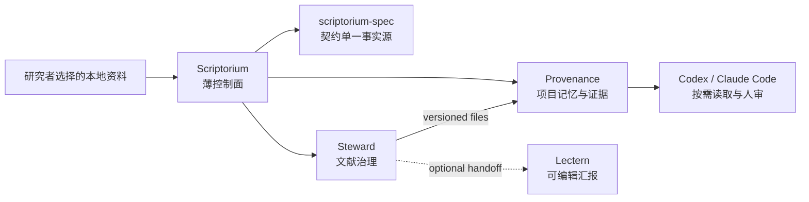

# Scriptorium：把科研 Agent demo 做成可验证的本地系统

> 项目状态：Public Alpha · Windows-first · 本地优先 · Agent 原生
> 这是一份产品与工程案例，不是科研成果声明。


## 30 秒看结果

Scriptorium 解决的不是“再做一个聊天框”，而是一个更基础的问题：科研工作者与 Agent
协作后，研究问题、证据、决定和下一步如何跨会话延续，并且仍由用户掌握事实所有权。

当前 Public Alpha 交付了一条可复现的合成纵向链路：

- 3 条明确标注为合成的文献记录，其中 2 条命中研究边界，1 条负例被排除；
- 通过公开 CLI 与版本化文件依次运行 Spec、Steward 和 Provenance；
- 9 个跨组件阶段全部返回 `exit 0`；
- 契约、主题边界、综述、记忆、检索和 MCP 共 6 项机器断言通过；
- 生成 9 个可检查产物，包括 Markdown 项目、综述、检索结果和本地 SQLite FTS5 索引。

证据不是宣传数字：[机器报告](showcase/evidence/demo-report.json)、
[证据清单](showcase/evidence-manifest.json)和
[Windows 隔离验收摘要](showcase/evidence/windows-uat-summary.json)可以交叉核验。
干净根替换后的远端发布门禁已经完成：经验证的代码提交
[`8069cbf1`](https://github.com/scriptorium-suite/scriptorium/commit/8069cbf1a2de4b31e8239740368799ff9519294e)、
[PR CI `29818934741`](https://github.com/scriptorium-suite/scriptorium/actions/runs/29818934741)与
[合成证据 artifact `8490533423`](https://github.com/scriptorium-suite/scriptorium/actions/runs/29818934741/artifacts/8490533423)
相互对应。旧提交对象的 GitHub 服务端垃圾回收与缓存清理仍在单独处理。

## 用户与待完成任务

目标用户是有一定 GitHub 开源项目配置能力、希望使用 AI4Science 提质增效的科研工作者。
他们可能只有模糊直觉，也可能已有 Markdown、PDF、Agent 对话或 Zotero 积累。

核心待完成任务是：

> 在不交出本地资料控制权的前提下，把零散研究输入变成可恢复、可追溯、可以继续执行的
> 科研项目，并从同一研究状态派生论文结构、阶段总结和汇报材料。

首发选择 Windows；Codex 与 Claude Code 是一等 Agent host。Zotero、Obsidian 和 Lectern
保持可选，避免把个人工具偏好变成产品硬依赖。

## 约束先于功能

| 产品原则 | 落地方式 |
|---|---|
| 本地资料属于用户 | Markdown、PDF、代码和运行数据留在用户选择的目录；套件不成为新的云端主库 |
| 文件契约而非内部耦合 | 组件只交换版本化 JSON/Markdown 文件，不导入彼此内部模块 |
| 写操作必须可见 | `preview`/`--run` 分离，已有文件不静默覆盖 |
| AI 输出不是事实 | 高价值声明先进入候选与审批区，用户确认后才能进入权威记忆 |
| 恢复能力优先 | 事件追加、锁、幂等和可恢复状态机优先于“全自动”叙事 |
| 隐私声明必须可验证 | demo 使用全合成数据、剥离凭据，并在报告中主动记录未验证边界 |

## 为什么拆成薄入口与独立组件



这个拆分服务两个产品目标：组件可以独立部署；同时，用户仍有一个统一入口检查安装、
初始化项目、查看状态和触发按需同步。代价是跨仓版本与契约治理更严格，因此
`scriptorium-spec` 被设为唯一契约事实源，CI 使用固定组件提交验证纵向链路。

## 一条真实接口、全合成数据的 walkthrough

1. `scriptorium doctor --target demo` 检查组件版本与能力，不把“源码存在”误报为可运行。
2. `scriptorium demo` 校验 `library-kb/1.1`，并调用 Steward 形成主题综述。
3. 主题边界负例验证相似名称不会被错误纳入研究方向。
4. Provenance 摄取合成文献与项目 Markdown，构建本地 FTS5 索引。
5. demo 通过只读 MCP 检查 portfolio、current context 与 literature search。
6. `demo-report.json` 固化版本、阶段、断言、产物和限制，使结果可重复核验。

这里没有 API Key、真实 Zotero、真实对话、在线模型或私人研究资料。Agent 草稿是仓库内
明确标注的 fixture。Lectern 也没有被算入本条黄金路径，因为生成幻灯片需要独立配置的
provider 路径。重复运行在功能上幂等，但带摄取时间戳的记录不承诺逐字节一致。

## 安全机制如何进入产品细节

- 初始化和数据操作默认只预览，只有显式 `--run` 才授权写入；
- workspace 与 Provenance 数据根必须分离，输出目录需要所有权标记；
- Windows 路径校验覆盖 symlink、junction/reparse、8.3 短路径和竞态；
- 子进程只继承最小环境白名单，不继承 provider 凭据；
- `status` 与 `inventory` 只返回白名单化聚合信息，不回显路径、文件名或研究正文；
- 未解析项目不会生成 `session-summary/1.0`，而是留在可恢复的待解析状态；
- 高价值声明必须经过人工勾选，Agent 不能自行把建议提升为项目事实。

## 验证矩阵

| 要证明的能力 | 公开证据 | 当前结论 |
|---|---|---|
| Windows 首装与源码安装 | [隔离验收摘要](showcase/evidence/windows-uat-summary.json) + [GitHub-hosted clean Windows E2E](https://github.com/scriptorium-suite/scriptorium/actions/runs/29818934741) | 通过 |
| Python 兼容 | Windows / Ubuntu，Python 3.11 / 3.12 | 通过 |
| 跨组件契约 | 9 阶段机器报告与固定版本基线 | 通过 |
| 无凭据合成 demo | 报告 `credentials_requested: []` | 通过 |
| 当前旗舰证据包未检出私人内容 | 合成 fixture、历史/路径/邮箱/secret 扫描与人工复核 | 通过（限本发布候选） |
| 远端候选证据链 | commit `8069cbf1` / run `29818934741` / artifact `8490533423` | 通过；旧悬空对象待 GitHub Support 清理 |
| 完整 Agent 工作流用户价值 | 尚无外部 beta 行为数据 | 未验证 |
| Claude Code SessionEnd 对等路径 | 仍缺 live golden-path 证据 | 未验证 |
| Lectern 跨仓生成 | 不属于当前 credential-free demo | 未验证 |

“未验证”不是隐藏在脚注里的免责声明，而是下一阶段产品判断的输入。

## 我在项目中的职责

该项目由本人发起并作为产品与技术负责人推进，采用 Agent 协作开发。公开仓库可以验证的
职责包括：

- 定义目标用户、JTBD、Windows-first 范围以及可选组件边界；
- 将“本地优先、人审、可恢复”转译为 CLI 权限模型和文件契约；
- 拆分统一入口与三个可独立产品，维护生产者/消费者和版本兼容关系；
- 设计合成黄金路径、负例、机器报告、Windows/Linux CI 与隐私发布门禁；
- 记录竞品与开源思路借鉴，同时保持独立实现和许可证边界；
- 把未完成项、已验证事实和产品主张分开表达。

这组工作希望展示的不是“功能数量”，而是 AI 产品经理在问题定义、边界设计、技术协同、
风险管理和可验证交付之间建立闭环的能力。

## 权衡与尚未完成

- 当前以 GitHub 源码安装为主，还没有 PyPI/winget 或图形安装器；
- editable 源码安装可能从已配置的包索引下载 Python 构建依赖；“运行期不申请网络动作”
  不是离线安装承诺；
- `inventory` 当前只做不读取正文的安全盘点与路由，实际迁移仍缺受审阅的
  manifest/apply 闭环；
- 完整 Public Alpha 需要用户已经安装 Codex 或 Claude Code，并主动安装项目级 Skill；
- Claude Code `SessionEnd` live 对等验证、Lectern schema-driven E2E 与外部用户 beta 仍待完成；
- demo 的“无网络动作”来自实现与环境白名单，尚未由操作系统级网络沙箱观测；
- 尚无真实用户效率数据，因此不宣称已经证明科研质量或节省了确定比例的时间。

下一阶段优先验证三个指标：首次成功运行耗时、下一次会话恢复上下文的人工可接受率、
以及高价值候选声明的确认/驳回与冲突率。目标值会在获得外部 beta 基线后确定，不用臆测
数字代替研究。

## 复现

按[中文 README](../README.zh.md#windows-源码快速体验)克隆四个仓库并安装后运行：

```powershell
.\.venv\Scripts\scriptorium.exe doctor `
  --target demo `
  --spec-root ..\scriptorium-spec `
  --steward-root ..\steward `
  --provenance-root ..\Provenance

.\.venv\Scripts\scriptorium.exe demo `
  --output .\scriptorium-demo `
  --spec-root ..\scriptorium-spec `
  --steward-root ..\steward `
  --provenance-root ..\Provenance
```

预期结果是 9 个阶段均为 `exit 0`，`demo-report.json` 中 6 项断言为 `true`。请先阅读
[录制与证据边界](showcase/README.zh-CN.md)，不要把真实科研资料用于公开演示。

开源思路借鉴与独立实现边界见[设计借鉴与致谢](../ACKNOWLEDGEMENTS.zh.md)。
